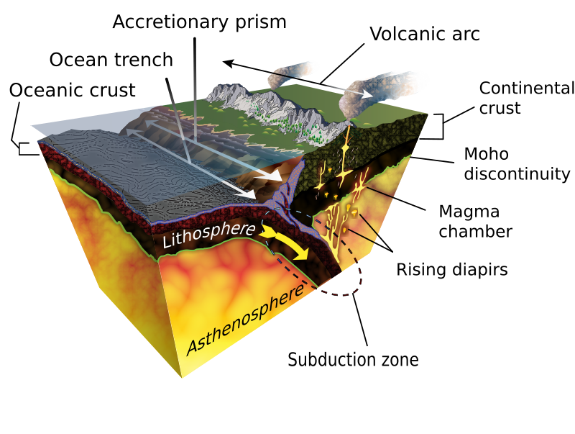
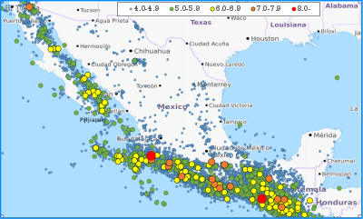
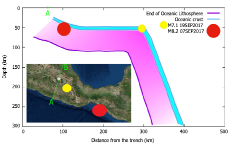
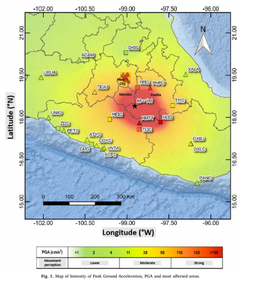
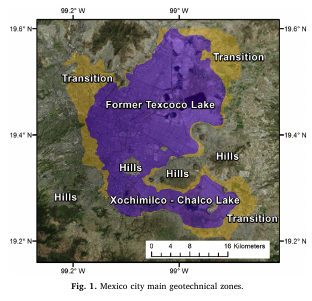
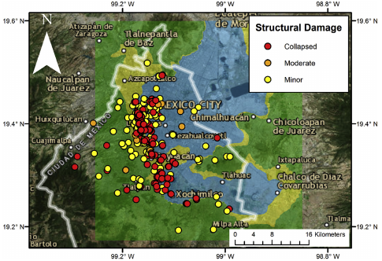
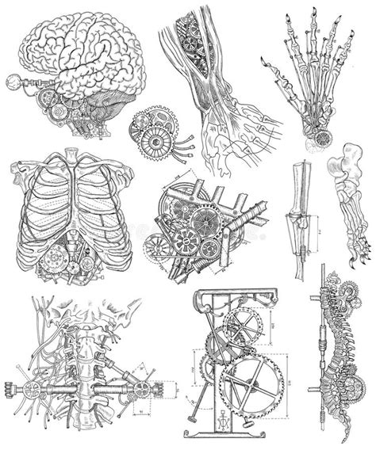
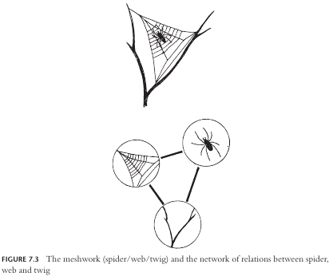
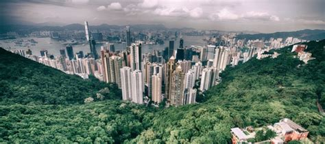

background-image: url('https://www.periodicocentral.mx/2017/images/terremoto85-9.jpg')
background-position: left
background-size: cover
class: left, top

```{r setup, include=FALSE, echo=FALSE}

options(htmltools.dir.version = FALSE)

knitr::opts_chunk$set(echo = FALSE, warning = FALSE)

library(tidyverse)
library(extrafont)
library(here)
library(patchwork)


xaringanExtra::use_fit_screen()
xaringanExtra::use_tile_view()
xaringanExtra::use_panelset()
```


## Puebla-Morelos Earthquake! 

### Seismologists and social scientists in conversation

 <p style="font-size:15px">Badziai Vitali</p>
 
 <p style="font-size:15px">Mallak Khouloud</p>
 
 <p style="font-size:15px">Martínez-Herrera Gonzalo</p>


---
layout: true
background-image: url("concrete-crack-repair.jpg") 
background-position: -25%
---

### Contents

* Undergraduate presentation
  
  + Geological background of Mexico seismicity
  
  + Review of September 2017 M8.2 and M7.1 earthquakes
  
  + Social construction of seismic risk in Mexico City
  
<br>  

* Graduate level discussion

  + Reflexions from the analysis of earthquakes in Mexico City
  
  + Complexity and framing of questions: How to integrate natural and social perspectives?
  
  + Theoretical approaches to risk analysis
  

---
layout: false
background-image: url('https://i.insider.com/579f9ef9dd089549398b47aa?width=1200')
background-size: cover
class: top, center

# .grey[The nature of earthquakes]

---
layout: true
background-image: url("concrete-crack-repair.jpg") 
background-position: -25%
---

### Seismic profile

<br>

.pull-left[
* Central western Mexico is one of the most complex geotectonic regions of the country.

+ Mexico is located on convergence of several geological structures and atop three plates <sup>1</sup>.

* One of the most seismologically active regions in the world.
  ]

.pull-right[


<br>


]

.footnote[Benz *et al.* 2011.]
---
### Seismic history

Mexico has a long history of destructive earthquakes and volcanic eruptions.

<!-- The focal mechanism solutions are predominantly of reverse type at the coast and normal type inland and are attributed to the subduction of the Rivera and Cocos plates under the North America Plate [2]. In the region, low-magnitude earthquakes occur frequently in the form of upper-crust shallow-depth sequences and swarms, which have been associated with the fractured nature of the Trans-Mexican Volcanic Belt (TMVB). -->
 
 <br>
 
.pull-left[
```{r earth history, echo=FALSE, include=TRUE}

tibble(Earthquake = c(7.7,8,7.3,7,7,7.5),
       Year = c(1858,1931,1973,1980,1999,1999)) %>% 
  kableExtra::kbl(booktabs = T, format = 'html', 
                  caption = 'Historic intraslab earthquakes') %>% 
  kableExtra::kable_styling(font_size = 12) %>%  
  kableExtra::column_spec(column = 1:2, width = '8em')

```
]

.pull-right[
]

---
### September 1985:

<br>

.pull-left[
* 19:  M 8.1 earthquake killed more than 10,000 people in Mexico City<sup>1</sup>
  
* Subduction fault

* 21: M 7.5 aftershock 
  
* Damages due to high plasticity of soil clays <sup>1</sup>]

.pull-right[
]


.footnote[<p style="font-size:15px">[1] Mayoral *et al*., 2019</p>]
---

### 2017 Earthquakes 

.panelset[

.panel[.panel-name[September 7th]

* M 8.2 in Chiapas region.

* Occurred within the Cocos plate.

* strange since this mechanism does not produce large earthquakes.

* Largest earthquake in more than a century.

.center[
]

<br>
<br>

.footnote[[1] Sarlis *et al*., 2018]

]

.panel[.panel-name[September 19th]

.pull-left[
  + Exactly 32 years after 1985 M8.1.

  + Intraslab normal faulting mechanism due to subduction of Cocos plate (Also within the plate).
  
  + Magnitude 7.1.
  
  + Affected the states of Puebla, Morelos, and Mexico City.]


]

.panel[.panel-name[Consequences]

.pull-left[
* 369 deaths.

* Numerous buildings, roads and bridges.]

```{r earthquake stats, fig.width=7, fig.height=4, fig.align='center'}

deaths <- tibble(state = c("Mexico City", "Morelos"),
       deaths = c(60, 20)) %>% 
  ggplot(aes(x = state, y = deaths)) +
  geom_col(aes(fill = state), show.legend = F) +
  xlab(label = "State") +
  ylab(label = "Deaths (%)") +
  ylim(c(0,100)) +  
  # title(main = 'Number of deaths') +
  theme_minimal() +
  scale_fill_manual(values = alpha(MaizePal::maize_pal(name = "HopiBlue"), alpha = 0.75), aesthetics = "fill")

build <- tibble(cat = c("Collapse", "High Risk", "Security uncertain"),
       n = c(38, 340, 273)
       ) %>% 
  mutate(n_por = (n * 100)/651) %>% 
  ggplot(aes(x= cat, y = n_por, fill = cat)) +
  geom_col(show.legend = F) +
  xlab(label = "Category") +
  ylab(label = "Buildings (%)") +
  # title(main = 'Buildings damaged') +
  theme_minimal() +
  scale_fill_manual(values = alpha(MaizePal::maize_pal(name = "OaxacaGreen"),alpha = 0.75))

deaths +  build

```
]
]
---
layout:false
class: inverse
background-image: url("https://i.pinimg.com/736x/a8/57/6a/a8576acaa8b22de82c69a96d73fa16b0--funny-stuff.jpg")
background-size: contain
---
name: history1
layout:false
background-image: url('http://historycollection.com/wp-content/uploads/2017/06/77465b402167eb302c7641840def2b6b.jpg')
background-size: cover
class: center

.white[Mexico City was founded over the remnants of Tenochtitlan, the capital of the Mexica (Aztec) empire that located in an islet in the Texcoco lake.]

---
name: history2
layout:false
background-image: url("https://uploads6.wikiart.org/images/jose-maria-velasco/vistas-del-valle-de-m-xico.jpg") 
background-size: cover

.center[Spaniards artificially dried the lake changing the physical properties of the soil.]

<p style="color:white">.footnote[José María Velasco, *Vistas del Valle de México*]</p>

---

# Making sense of destruction

---
layout: true
background-image: url("concrete-crack-repair.jpg") 
background-position: -25%
---

.panelset[

.panel[.panel-name[1985]

* High population and soil features of Mexico City <sup>1</sup>. 

* Soft soil experienced more acceleration than rock outcrop <sup>2</sup>. 

* 8 % soft-story





.footnote[<p style="font-size:15px">[1] Mayoral <i>et al.</i>, 2019.</p>
<p style="font-size:15px">[2] Franke <i>et al</i>, 2019.</p>]

]

.panel[.panel-name[2017]

* Location on soft soils or transition zones (zones II and III).

* Location of building on the streets.

* More than 50 % of collapsed buildings ha d soft-stories <sup>1</sup>.

* Parking lots beneath the ground and masonry to support the walls.

* Between 4 to 8 floors.
]
]

---
### The social in the natural

<br>

+ Introduction to the concept of vulenerability, resilience, and frameworks.

+ Mitigation through knowledge and .RUred[politics].

---
### Features of collapsed buildings

.panelset[

.panel[.panel-name[Collapsed buildings]

```{r collapsed buildings, echo=FALSE, include = TRUE, fig.align='center', fig.height=5}

col_build <- readxl::read_excel(path = here("3. Proyecto/2. Data/col_build.xlsx"),
                              sheet = 1, trim_ws = T)
                              
col_build <- rename(col_build, Age = age)

pal <- MaizePal::maize_pal(name = "OaxacaGreen", n = 5, type = "discrete")

pal2 <- MaizePal::maize_pal(name = "MaizMorado", n= 5, type = "discrete")

col_build %>% 
  group_by(use,collapse, Age, add = T) %>% 
  tally(sort = T) %>% 
  mutate(n_por = (n * 100)/ 44) -> g_col


g_par <- g_col %>% 
  filter(collapse == "Partial") %>% 
  ggplot(aes(x = reorder(use, + n_por), y = n_por)) +
  geom_col(aes(fill = Age)) +
  xlab('Use') +
  ylab('Percentage of buildings') +
  ylim(0, 100) +
  ggtitle(label = 'Partial') +
  scale_fill_manual(values = alpha(colour = pal, alpha =  0.75))


g_tot <- g_col %>% 
  filter(collapse == "Total") %>% 
  ggplot(aes(x = reorder(use, + n_por), y = n_por)) +
  geom_col(aes(fill = Age)) +
  xlab('Use') +
  ylab('Percentage of buildings') +
  ylim(0, 100) +
  ggtitle(label = 'Total') +
  scale_fill_manual(values = alpha(colour = pal2, alpha =  0.75))

g_col <-  g_par / plot_spacer() / g_tot +
  plot_annotation(tag_levels = 'A', tag_suffix = ')') 

g_col & theme_minimal() 
  
```

<!-- <p style="font-size:15px">.footnote[Galvis *et al.* 2020.]</p> -->

]

.panel[.panel-name[Damaged buildings]

<!-- * Total 284 buildings. -->

```{r damaged buildings, fig.align='center', fig.height=5}

dam_stor <- tribble(~n_sto,~n_por, ~orden,
                   '1 - 2', 23.6, 1,
                   '3 - 4', 14.8, 2,
                   '5 - 6' , 32.7, 3,
                   '7 - 8', 18.7, 4,
                   '9 - 10', 7.7, 5,
                   '11 - 12', 1.1, 6,
                   '12 -13', 1.4, 7) %>% 
  ggplot(aes(x = reorder(n_sto, + n_por), y = n_por)) +
  geom_col(fill = alpha(pal[4], alpha = 0.75)) +
  xlab('Number of stories') +
  ylab('Percentage of buildings') +
  ggtitle(label = 'Number of stories') 


dam_use <-tibble(use = c('Residential', 'Residential & Business', 'Business', 'Educational', 'Industrial', 'Other'),
                  n_por = c(66.2,15.69,12.2,1.05,1.05,3.81)) %>% 
  ggplot(aes(x = reorder(use, + n_por), y = n_por)) +
  geom_col(fill = alpha(pal2[2], alpha = 0.75)) +
  xlab('Use and occupancy') +
  ylab('Percentage of buildings') +
  ggtitle(label = 'Use type') 

g_dam <- dam_stor / plot_spacer() / dam_use +
  plot_annotation(tag_levels = 'A', tag_suffix = ')') 

g_dam & theme_minimal() 
  
```

<!-- <p style="font-size:15px">.footnote[[1] Jara *et al.* 2019.]</p> -->
]

]
---
<br>

.center[
]

---
### References

<p style="font-size:15px">
Benz, H.M., Dart, R.L., Villaseñor, Antonio, Hayes, G.P., Tarr, A.C., Furlong, K.P., and Rhea, Susan, 2011, Seismicity of the Earth 1900–2010 Mexico and vicinity: U.S. Geological Survey Open-File Report 2010–1083-F, scale 1:8,000,000. </p>

<p style="font-size:15px">
Franke *et al*. 2019. Observed building damage patterns and foundation perfomance in Mexico CIty following the 2017 M7.1 Puebla-Mexico City earthquake. <i>Soild Dynamics and Earthquake Engineering. 125(105708)</i> </p>

<p style="font-size:15px">
Mayoral *et al*, 2019. The september 19, 2017 M 7.1 Puebla-Mexico city earthquake: important findings from the field</p>

<p style="font-size:15px">
Galvis *et al.* 2020. Overview of collapse buildings in Mexico City after September 2017 (M<sub>w</sub> 7.1) earthquake</p>

<p style="font-size:15px">
Sarlis N. *et al*. 2019. Natural time analysis: On the deadly Mexico M8.2 earthquake on 7 September 2017. <i>Physica A. (506)</i>:625-634. </p>
---
layout: false
class: middle, center

# Graduate level discussion

---
layout: true
background-image: url("concrete-crack-repair.jpg") 
background-position: -25%
---
name: Cartesian

### Cartesian system

Reponsible of the externalization of nature.

Mechanistic vision of organisms (control, extrapolation).



<br>

<br>

.center[
 Nature / Society
 
 Body / Mind
]


???

* The origin of the dualism in science dates back to  Rene Descartes, who is...

* This system, between other things proposes...


---
name:Consequences

### Consequences

.pull-left[
* The dualist Nature/Society model has dominated scientific thought (classic physics mainly).

* Incapacity to understand modern complex problems, their origins, and their trends.

* The use of mechinistic analogies obsecure limit the understanding of biological systems¹.

* Key word: **interaction**.


.footnote[<p style="font-size:15px">[1] Lewontin y Levins. 2007. *Are we programmed?* </p>

<p style="font-size:15px">[2] Ingold. 2011. *When ANT meets SPIDER: Social theory for arthropods*]</p>
]

.pull-right[ 
<p style="font-size:13px">[2]</p>]

???

* El dualismo Cartesiano ha impactado de manera profunda en el desarrollo de la ciencia a través de un pensamiento reduccionista que considera que es posible entender el todo a partir del estudio de las partes.

* Analogía del cuerpo como un reloj, o de una computadora (cerebro) a partir del desarrollo de la era digital.

* El desarrollo de ramas que, si bien reconocen la importancia del ambiente en los probeblas sociales, no la integran adecuadamente en la práctica.

* Lo anterior se refleja en la idea de la interacción, la cual ocurre en elementos necesariamente separados.


---

### Environmental determinism

<br>

* *Nature* forces are the cause of disasters

* Interpretations of nature do not recognize the diversity of *interactions* with it.

* Modernization theory: 
  
  + Linear evolution of society and economy.
  + Technological solutions.
  
* Reflects Cartesian division Nature/Society

---

### Political Ecology

* Stems from political economy.

* Oppposes to the modernization theory.

* Systems perspective as a mean to analyze disasters.

Limitations:

* Does not explain systems' vulnerabilities during disaster events.

* Emphasis on the political analysis a the cost of superficial ecological analysis.

---

name: Arithmetic

### Green arithmetic

Unable to analytically synthesize society **in** nature.

.pull-left[
$Nature +  Society$

* Politcal Ecology
* Environmental History
* Environmental Sociology
* Ecological Economy
* Environmental Anthropology
* Systems Ecology]

<br>

.center[
.bottom[]]

???
* Pueden tener una premisa filosófica que parta de la indivisibilidad de la sociedad y la naturaleza, pero en la práctica esto no ha sido implementado.


---
### Environmetal History (World-Ecology Synthesis)

*  A framework proposal to surpass the Nature/Society division.

* Dialectics: Emphasis on the relationships instead of things

* *Oikeios*: The relationship between an organism and its environment. 

  + Gives rise to diverse configurations of relationships
  
  + Historical perspective: History is made by *how* the environment configure with social processess.
  

???

*Oikeios*: The relationship between an organism and its environment. Gives rise to diverse configurations of relationships

How many ways the inorganic elements configure with the biological and social elements and processes.


